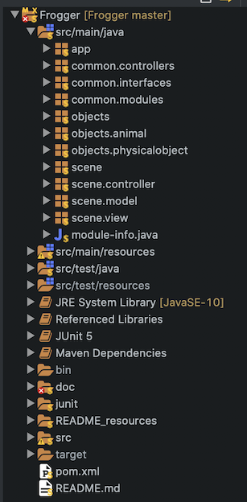
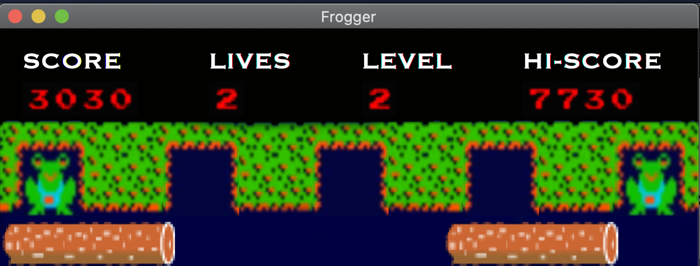
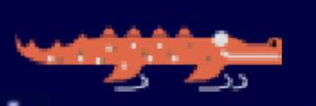
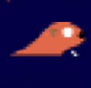
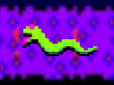

Software Maintenance Coursework2
====

Test Environment and Build Script:
----
*   Tested on: **Mac** 10.15.1, **Eclipse** 2019-09 R (4.13.0), **JavaSE 10**, **JavaFX 13**, corresponding JavaFX libraries are added externally. Cannot guarantee if it works on lab machines.
*   Build Script: **Maven**
    - Firstly, enter `Frogger` repository and in terminal run `mvn clean` to clean previous configuration.
    - To run the game, in terminal run `mvn javafx:run`.
    - To run Junit tests, in terminal run `mvn test`. ps: It may fail if tests fail. If it happens, run `mvn test` again.

Maintenance and Refactory: 
----

*   **Modified `Main` class:**
    - Moved all settings of the game screen into `GameLevelBuilder`. 
    - `Main` only remains a stage and start screen.
    - `Main` is only considered as an entry to the game and it shouldn’t be big.
*   **Reorganized packages:**
    - The old project put all resources and java files in one folder which made maintenance messy.
    - The final version has three root source folders which are `objects`, `scene` and `common`.<br>
    
*   **Applied Interface-segregation principle:**
    - Defined `Actable`, `Changeable`, `Displayable`, `Sinkable`, `AnimalObserver` and `ObservableAnimal` interfaces.
*   **Reduced the combination of code coupling, separated objects with event handlers and improved code-reuses:** to follow Object-oriented principles:
    - Game objects are added directly into the world and have no relationship with other objects or their classes. Each object is independent from other objects. For example, `Animal` can be taken away from the game without any effection on the game.
    - Removed methods from `Main` and `World` and made them seperate classes with static methods e.g. `ObjectsGetter` and `IntersectionDitector` so that they can be called muitlple times in diffeerent classes.
    - Game objects intersection and events are handled by controllers and handlers.
    - Extracted `timer` from `Main` and `World` and created an independent `GameTimer` owned by `GameSceneController`. 
*   **Changed game objects:**
    - Changed inheritance: 
        - Deleted ~~`Actor`~~ and created `GameObject` which is the super class of all game objects.
        - Created `MovableObject` extending from `GameObject` which has a `move()` method. 
        - All physical and movable game objects extends from `MovableObject`, `End` extends from `GameObject`.
    - All game objects have their concreate behaviour controller in their corresponding `ActionType` field except `Animal` (has many controllers). To manege behaviour well, all `act` functions are kept in `ActionType.java`. Every object has a responding action class implementing the interface `ActionType` which has an `act` method.
    <br>Take `Log` as an example, in `Log.java`, `Log` doesn't implement `act` but calls `act` in its `ActionType`:
    ```java
    public class Log extends MovableObject {

	    private ActionType actionType;
    	
    	public Log(String imageLink, int w, int h, int xpos, int ypos, double speed) {
		    setX(xpos);
		    setY(ypos);
		    setImage(new Image(imageLink, w, h, true, true));
		    actionType = new LogAction(this);
		    setSpeed(speed);
	    }
	    /**
	    * Calls the method act() in actionType in Log.act().
	    */
	    @Override
	    public void act(long now) {
	    	actionType.act(now);
	    }
	}
	```
	And in `ActionType.java`, `LogAction` class is actually responsible for `Log`'s action:
	<br> ps: These object action classes all implement `ActionType` interface and all defined in `ActionType.java`, which made these classes private and **invisible in Javadoc**
	```java
	class LogAction implements ActionType {

	private Log log;
	
	public LogAction(Log log) {
		this.log = log;
	}

	@Override
	public void act(long now) {
		log.move(log.getSpeed() , 0);
		if (log.getX()>600 && log.getSpeed()>0)
			log.setX(-220);
		if (log.getX()<-300 && log.getSpeed()<0)
			log.setX(600);
	    }
    }
    ```
	- Deleted redundancy methods in `Animal` and created controllers for it.
*   **Applied MVC on different screens:**
    - Created a view, a controller and an entity for every scene. Each entiry owns a view and a controller.
    - `GameScene` has a scene model which saves data and models in `GameScene`.
*   **Applied three design patterns:**
    - ***Singleton***: To get the score of `Animal` in different scenes (game, end and history screen), define `Animal` as Singleton to make it globally accessible. When restarts the game, delete Singleton instance.
    - ***Observer***: To display current score of `Animal` in real time, `BoardController` observes the score stored in `AnimalModel`. When score changes in `AnimalModel`, `Animal` notifies its observers(`BoardController`) to update score on game screen.
    - ***Strategy***: Defined objects action in `ActionType`. Game object owns a field of `ActionType`. They call `act()` defined in `ActionType`.
*   **Fixed the score displaying bug:**
    - Removed old display mode.
    - Adding digit to a `HBox` and saves the reference. Clearing old images when adding new images into it.
*   **Deleted ~~`MyStage`~~ and created `GameMusicPlayer` to play and stop music.**


Extension: 
----

*   Created common GUI components, e.g. `dataBox` and `inputBotx`.
*   Added a start screen.
*   Added an info screen.
*   Added an end screen.
*   Added a history screen.
*   **Added new objects to the game screen:**
    - Added a game board to display score, lives of frog, game level and the highest score.<br>
    
    - **Added extra objects:** 
        - ***Bonus***: Appears in end places, adds 500 pts to player’s score if frog eats it. <br>
        - ***Crocodile***: Swims in the river, when it opens mouth, frog will die if standing on it. <br>
        - ***Seal***: Swims in the river, when it sinks, frog will die if standing on it. <br>
        - ***Snake***: Walks on the middle purple road, when it reaches ends of the map, turns around. <br>
*   Designed 4 levels.
*   Added lives to `Animal` (5 in total).
*   **Created a `GameLevelBuilder` to build worlds with different levels.**
    - It is only responsible to game view, not action.
    - Future game development could directly add GUI object in this builder.
*   Added buttons in scenes to implement scene change: when clicking on these buttons, creates a new scene and sets the produced scene on current stage.
*   **Created a permanent score list (`Score.txt`) in resources.**
*   Created a `ScoreFileProcessor` class to access score file, grab highest score and write new record to the file.

Unit Tests:
----
*   Only very low level classes like `AnimalModel` or `BoardModel` are tested.
*   Tests related to GUI cannot be tested on Eclipse without starting the game.

UML(class diagram): 
----
*   To illustrate better on the whole layout of maintenance and hierarchy of the project, I put nearly all classes on UML.
*   MVC can be easily noticed, though easy scenes like start scene, info scene don't have models.

